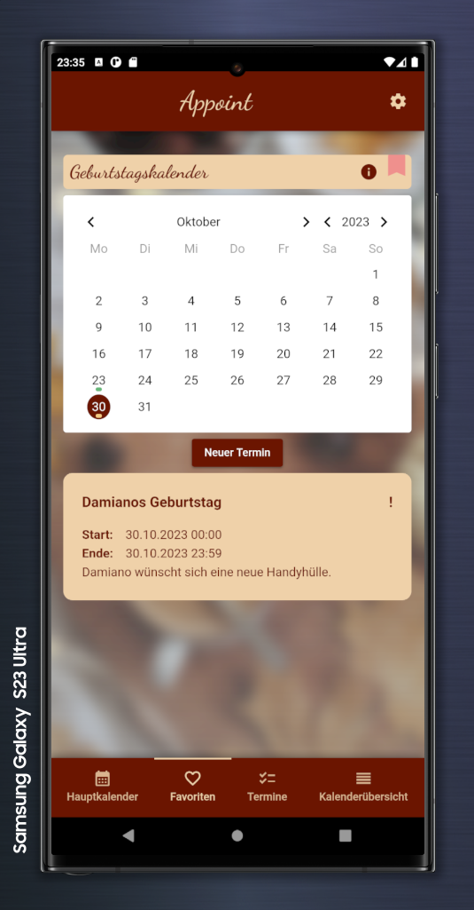
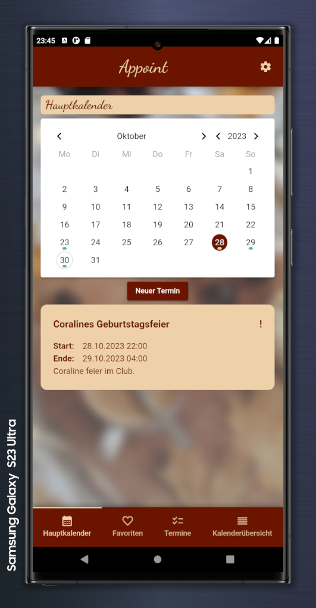
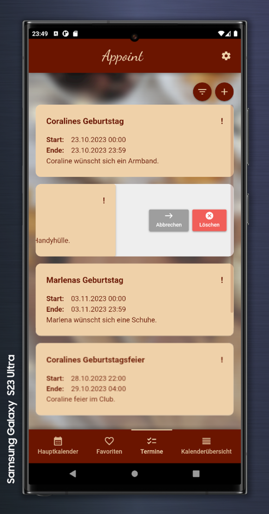
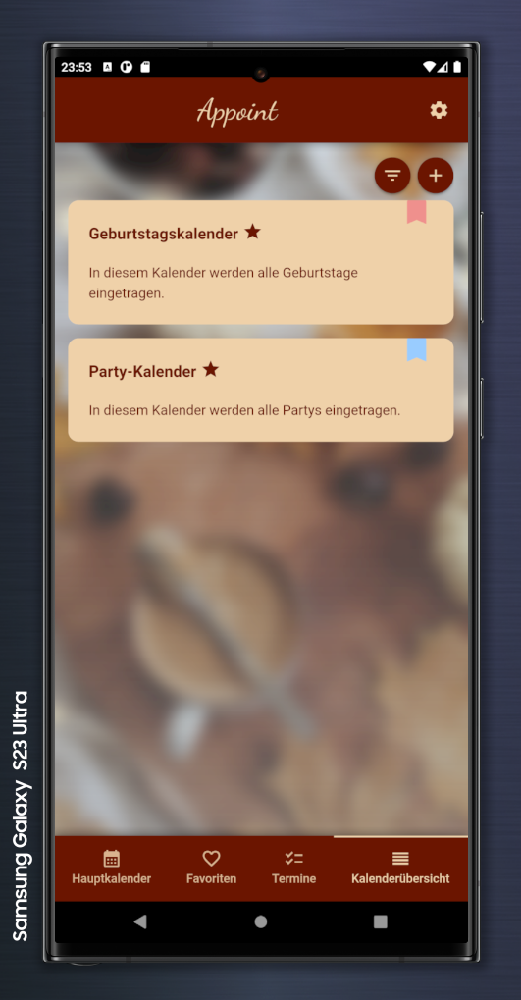
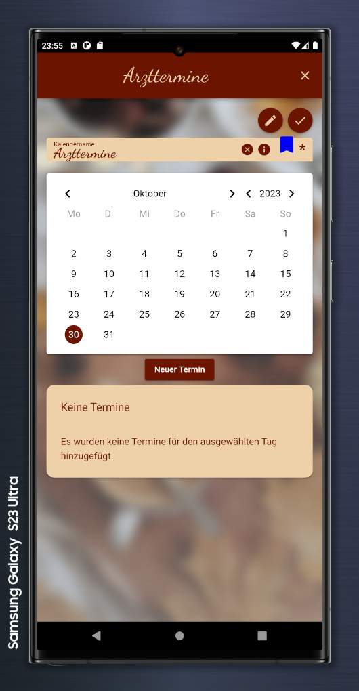
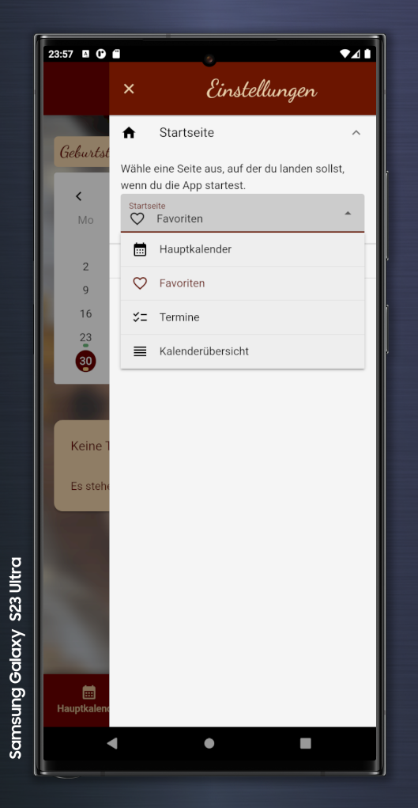
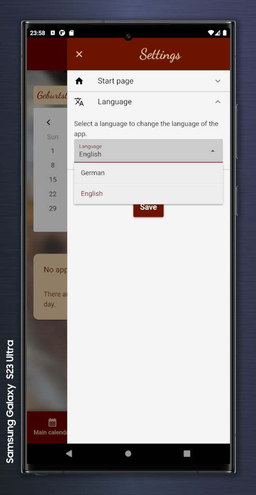
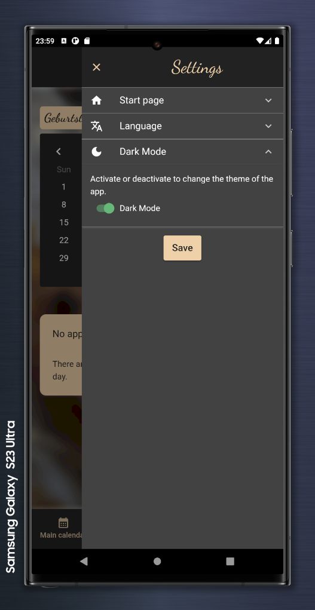
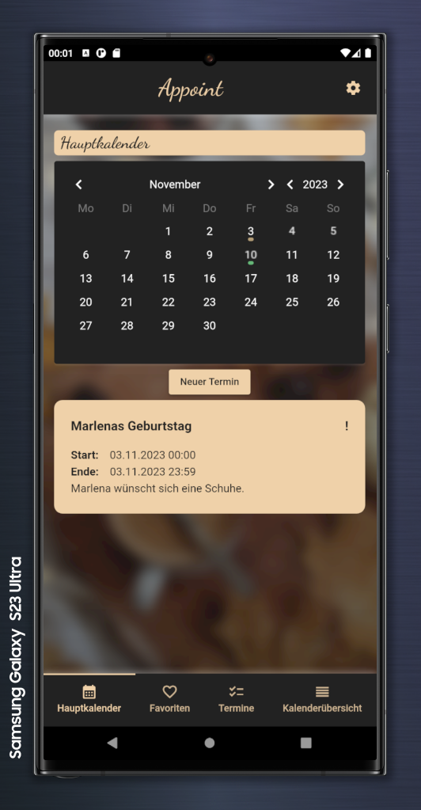

# Appoint (appoint)

Appoint is a calendar app developed by [cy-rae](https://github.com/cy-rae) in the programming language TypeScript with the Vue.js, Quasar and Cordova frameworks.
With Appoint you can manage all your appointments in multiple calendars locally on your phone.

## Content

### Manage your favorite calendars


### View ALL appointments in your main calendar


### List and filter all of your appointments and calendars



### Create or edit calendars and appointments


### Configure your start page


### Configure the language


### Switch to dark mode



Background image source: [Pexels](https://www.pexels.com/de-de/foto/kaffee-tisch-herbst-dekoration-9622379/)

## Install the dependencies
```bash
yarn
# or
npm install
```

### Start the app in development mode (hot-code reloading, error reporting, etc.)
```bash
quasar dev
```


### Lint the files
```bash
yarn lint
# or
npm run lint
```


### Format the files
```bash
yarn format
# or
npm run format
```


### Build the app for production
```bash
quasar build
```

### Customize the configuration
See [Configuring quasar.config.js](https://v2.quasar.dev/quasar-cli-vite/quasar-config-js).


# Cordova
## Setup
For software version see [Cordova Preparation](https://quasar.dev/quasar-cli-vite/developing-cordova-apps/preparation).
1. Install Android Studio
2. Install Java 8
3. Install Gradle 4.10.3
4. Install Android SDK 33 & 9 with Android Studio SDK Manager
5. Install SDK Tools (Obsolete) with Android Studio SDK Manager (under SDK Tools)
6. Install command line tools with Android Studio SDK Manager (under SDK Tools)
7. Adjust environment variables:
   1. JAVA_HOME -> Java 8
   2. ANDROID_HOME -> Users/xyz/AppData/Local/Android/SDK/
   3. ANDROID_SDK_ROOT -> Users/xyz/AppData/Local/Android/SDK/
   4. GRADLE_HOME -> Gradle 4.10.3
   5. Path:
      1. %JAVA_HOME%\bin
      2. %ANDROID_SDK_ROOT%\tools
      3. %ANDROID_SDK_ROOT%\platform-tools
      4. %ANDROID_SDK_ROOT%\cmdline-tools
      5. %GRADLE_HOME%\bin

## Storage plugin
See [Cordova Storage Doc](https://cordova.apache.org/docs/en/latest/cordova/storage/storage.html).
